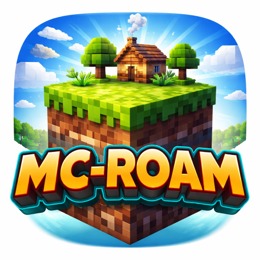

# MC Roam

<div align="center">
  
  <br/>
  <b>Cloud-Synced Multiplayer Minecraft Server Manager</b>
  <br/>
  [](https://opensource.org/licenses/MIT)
  [](https://github.com/Student9876/mc-roam/actions)
</div>

---


## What is MC Roam?

## Index

- [Key Features](#key-features)
- [Who is it for?](#who-is-it-for)
- [Basic Installation](#installation)
- [Usage (Advanced/Developers)](#usage-advanceddevelopers)
- [Building from Source](#building-from-source)
- [What Can You Do?](#what-can-you-do)
- [Project Structure](#project-structure)
- [Technologies Used](#technologies-used)
- [Contributing](#contributing)
- [Security](#security)
- [License](#license)
- [Acknowledgments](#acknowledgments)
- [Support](#support)


**MC Roam** is a desktop application that revolutionizes Minecraft server hosting for friends and communities.

> **Your server, your hardware, your rules.**
> 
> **MC Roam runs directly on your PC—no online server RAM limitations, no hidden costs.**
> Host, manage, and play Minecraft servers from anywhere, with seamless cloud sync and zero port forwarding.

- **No more server headaches:** Anyone in your server group can host, and your world is always up-to-date.
- **Cloud-powered:** All server data is synced via Google Drive, OneDrive, or any Rclone-compatible storage.
- **Admin made easy:** Assign trusted admins, manage players, and tweak settings in real time.

---

## Key Features

* Cloud Sync: Store and sync your Minecraft server data across devices and hosts.
* Multi-Host: Any member of the server group can start the server—no need to keep one PC always online.
* Easy Player Management: OP, ban, kick, whitelist, and more, all from a modern UI.
* Admin System: Owners can promote admins for shared management.
* No Port Forwarding: Public tunneling via Playit.gg—play with friends, no router setup.
* Real-Time Settings: Change world rules and properties while the server is running.
* Built-in Terminal: View logs and send console commands directly from the app.

---

## Who is it for?

- **Friends who want to share a Minecraft world, without any cloud service limitation.**
- **Groups who want easy, secure, and portable server management.**
- **Anyone who wants to host Minecraft servers without any resource limitaion of online services as it runs on your PC.**

---

## Installation

### Prerequisites

- **Windows 10/11** (64-bit)
- **Rclone-compatible Cloud Storage** (Google Drive, OneDrive, etc.)

### Quick Start

1. **Download** the latest release from [Releases](https://github.com/Student9876/mc-roam/releases)
2. **Run the Application**
   - Double-click `mc-roam.exe`
   - Create an account (no config needed!)
   - Authorize your cloud storage
   - Create or join a server

> **Note:** The release biuld is integrated with owners database. So just connect your playit.gg account and play.

## Usage (Advanced/Developers)

**Want to build MC Roam yourself, use your own MongoDB/Google Cloud, or contribute?**

- See the [Building from Source](#building-from-source) section below.
- You can configure your own MongoDB, Google OAuth, and Rclone settings via a `.env` file.
- All advanced configuration and developer instructions are in the [docs/](docs/) folder.

### Building from Source

**Requirements:**

- [Go 1.21+](https://go.dev/dl/)
- [Node.js 20+](https://nodejs.org/)
- [Wails v2](https://wails.io/docs/gettingstarted/installation)

**Build Steps:**

```bash
# Clone repository
git clone https://github.com/Student9876/mc-roam.git
cd mc-roam

# Install Wails
go install github.com/wailsapp/wails/v2/cmd/wails@latest

# Install frontend dependencies
cd frontend
npm install
cd ..

# Build
wails build -ldflags "-X 'mc-roam/backend.MongoDBURI=YOUR_MONGODB_URI' -X 'mc-roam/backend.GoogleClientID=YOUR_GOOGLE_CLIENT_ID' -X 'mc-roam/backend.GoogleClientSecret=YOUR_GOOGLE_CLIENT_SECRET'"
```

This command builds the MC Roam application and injects your custom environment variables directly into the binary using Go's `-ldflags` option:

- `YOUR_MONGODB_URI`: Replace with your MongoDB connection string (e.g., from MongoDB Atlas).
- `YOUR_GOOGLE_CLIENT_ID`: Replace with your Google OAuth client ID.
- `YOUR_GOOGLE_CLIENT_SECRET`: Replace with your Google OAuth client secret.

By passing these values at build time, you avoid the need for a separate `.env` file and ensure the app is configured with your credentials out of the box. Never commit real credentials to your repository.

# Output will be in build/bin/mc-roam.exe

> **For Developers:** If you need to override default services (MongoDB, Google OAuth), create a `.env` file with your own credentials. See `.env.example` for details.

---

### What Can You Do?

**Server owners can:**
- Assign admin privileges to trusted members
- Delete servers
- Manage all settings

**Admins can:**
- Modify server properties
- Change world settings
- Manage players (op, ban, kick, whitelist)
- Send console commands

**Regular members can:**
- Start and stop servers
- Play when server is online

## Project Structure

```
mc-roam/
├── backend/           # Go backend logic
│   ├── app.go        # Main application logic
│   ├── runner.go     # Server execution
│   ├── rclone.go     # Cloud sync
│   ├── playit.go     # Public tunneling
│   └── ...
├── frontend/         # React frontend
│   ├── src/
│   │   ├── pages/    # Dashboard, Auth
│   │   └── components/  # Modals, Cards
│   └── ...
├── build/            # Build assets
├── .github/          # CI/CD workflows
└── README.md
```

## Technologies Used

- **Wails v2**: Modern Go + Vite + React desktop app framework
- **Database**: MongoDB
- **Cloud Sync**: Rclone
- **Tunneling**: Playit.gg

## Contributing

Contributions are welcome! Please feel free to submit a Pull Request.

1. Fork the repository
2. Create your feature branch (`git checkout -b feature/AmazingFeature`)
3. Commit your changes (`git commit -m 'Add some AmazingFeature'`)
4. Push to the branch (`git push origin feature/AmazingFeature`)
5. Open a Pull Request

## Security

- **Never commit `.env` files** with real credentials
- MongoDB credentials are environment-based
- Rclone configs are stored per-server in database
- Passwords are bcrypt-hashed

## License

This project is licensed under the MIT License - see the [LICENSE](LICENSE) file for details.

## Acknowledgments

- [Wails](https://wails.io/) - Amazing Go + Web framework
- [Rclone](https://rclone.org/) - Cloud storage sync
- [Playit.gg](https://playit.gg/) - Tunneling service
- [PaperMC](https://papermc.io/) - Optimized Minecraft server

## Support

For issues, questions, or feature requests, please open an issue on GitHub.

---

Made by [Student9876](https://github.com/Student9876)
